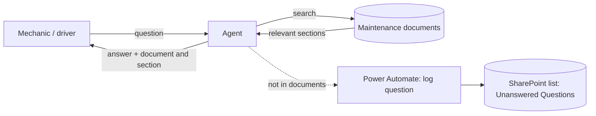

Maintenance Knowledge Agent

A chat assistant for garage staff. A mechanic or driver asks a question such as "What is the brake inspection interval for a tractor unit?" or "What do I do if I find a hydraulic leak?". The agent searches the maintenance documents, answers in plain language, and names the document and section the answer came from. If the documents do not cover the question, it says so and does not guess.

This is retrieval-grounded question answering: answers come only from a controlled set of documents, with citations, and "I don't know" is a valid answer.

> All 10 maintenance documents in this repo are original training documents written for this project. Figures in them are illustrative and are **not** official maintenance guidance. No confidential company material is used.

## What is in this repo

| Part | Tool | Status |
|---|---|---|
| Agent (main deliverable) | Microsoft Copilot Studio | Instructions, settings and build guide included. Build and test in your own tenant: see `copilot-studio/` |
| Knowledge base | SharePoint document library | 10 documents in `docs/docx/` (source in `docs/md/`) |
| Logging action | Power Automate | Flow spec and list schema in `copilot-studio/power-automate-flow.md` |
| Comparison prototype | Python, scikit-learn, Anthropic API | Working code in `python-prototype/` |
| Test set | 20 questions with expected answers | `test/test_questions.json` and `.csv` |
| Tracking | Excel | `tracking/test-tracker.xlsx` (scores, summary, prompt change log) |
| Guides | Markdown | `guides/user-guide.md`, `guides/demo-script.md` |

## How it works



1. The user asks a question.
2. The agent searches the document library.
3. It writes an answer using only what it found, and cites the document and section.
4. If nothing relevant is found, it says so and logs the question for a person to review.

## The knowledge documents

| ID | Document | Notes |
|---|---|---|
| DOC-01 | Pre-trip inspection checklist | Overlaps with brakes, tires, coolant, battery |
| DOC-02 | Brake inspection procedure | Interval, wear limits, leak-down test |
| DOC-03 | Oil and filter change intervals | Overlaps with winter (oil grade) |
| DOC-04 | Tire pressure and tread checks | Overlaps with winter (pressure) |
| DOC-05 | Hydraulic leak response | Leak classes, injection injury |
| DOC-06 | Battery and jump-start safety | Overlaps with winter |
| DOC-07 | Defect reporting procedure | Category 1/2/3 defects |
| DOC-08 | Winter operation checklist | Pulls from several other documents |
| DOC-09 | Coolant and cooling system checks | Overlaps with oil disposal |
| DOC-10 | Lift, jack and lockout safety | Overlaps with brakes, tires |

The documents deliberately overlap in places (oil grade appears in DOC-03 and DOC-08, disposal in DOC-03 and DOC-09), and three topics are deliberately **not covered** (cab air conditioning, wheel nut torque values, diesel particulate filter replacement). Those gaps are what test the "don't guess" behaviour.

## Agent instructions (prompt design)

The instructions in `copilot-studio/agent-instructions-v1-baseline.md` cover six things: role, grounding rule, citation rule, refusal rule, safety rule (confirm with a supervisor for safety-critical steps) and style (short numbered steps). Each later version changes one thing and is recorded in the Prompt Change Log sheet of the tracker.

## Testing

20 fixed questions, written before any run:

| Type | Count | What it checks |
|---|---|---|
| Direct lookup | 10 | Answer is in one document |
| Multi-step / multi-document | 4 | Agent combines several documents |
| Vague | 3 | Agent asks or gives a safe pointer, does not guess |
| Out of scope | 3 | Correct answer is "I don't have that information" |

Each run scores three things per question: **answer correct**, **source correct**, **refused when it should have**. A question passes only if all three are correct. The workflow is baseline first, then one prompt change at a time, re-running all 20 questions each time.

## Python prototype

The same idea in about 250 lines of Python, to show what happens underneath a no-code tool.

```bash
pip install -r requirements.txt
cd python-prototype
cp .env.example .env            # add your ANTHROPIC_API_KEY

python -m src.cli --retrieve-only     # chat, show retrieved chunks only (no API key needed)
python -m src.cli                     # full chat with Claude
python -m src.evaluate --retrieval-only --k 3    # retrieval test, no API key needed
python -m src.evaluate                           # runs all 20 questions with Claude
```

How it works: each document is split by numbered section, TF-IDF (scikit-learn) ranks the sections against the question, the top 3 go to the Anthropic API with a "use only these excerpts and cite them" instruction, and the model must reply with a fixed refusal sentence if the excerpts do not answer the question.

## Results

### Python prototype, retrieval stage (measured)

Command: `python -m src.evaluate --retrieval-only --k 3` (and `--k 5`). Per-question detail is in `results/retrieval_eval_k3.csv` and `_k5.csv`. This measures only whether the right section reaches the model, not the final answer.

| Metric (17 answerable questions) | Top 3 | Top 5 |
|---|---|---|
| Correct document in results | 94% (16/17) | 94% (16/17) |
| Correct section in results | 65% (11/17) | 76% (13/17) |

### End-to-end answers (fill in after you run them)

Copy the final numbers from the Summary sheet of `tracking/test-tracker.xlsx`. Leave blank until measured.

| Run | Answer correct | Source correct | Refusal correct | Overall pass |
|---|---|---|---|---|
| Copilot Studio baseline | | | | |
| Copilot Studio, final prompt | | | | |
| Python prototype | | | | |

## What I learned

- **A similarity threshold cannot decide "I don't know".** In the retrieval test, the three out-of-scope questions scored 0.13 to 0.20 top similarity, while correct, answerable questions scored as low as 0.09 (multi-document) and 0.19 (jumper-cable order). The score ranges overlap, so no cutoff separates them. I kept the threshold only as a guard for "nothing matched at all" and moved the refusal decision into the prompt. With this guard, 0 of 3 out-of-scope questions are stopped before the model; the model has to refuse them itself.
- **Keyword retrieval misses multi-topic questions.** "It is -20 C and my tractor will not start" shares few words with the block heater and battery sections, so TF-IDF ranked the wrong sections. Semantic search (embeddings) would likely help; I have not tested that.
- **Overlapping documents are a feature of the test, not a bug.** They show whether the agent combines sources or picks one.
- **Citations at section level need numbered headings in the documents.** The agent can only cite what it can see.

## Limitations

- Documents are fictional and short. Real maintenance libraries have scanned PDFs, tables and conflicting versions.
- 20 questions is a small test set. Percentages move a lot with one question (5 percentage points each).
- "Answer correct" needs a human reader. The automated keyword check in the Python evaluation is only a first pass.
- The threshold and `k` were examined on the same 20 questions, so the retrieval numbers are not a clean held-out result.
- This is not a replacement for qualified maintenance staff or manufacturer manuals. Safety-critical steps always say to confirm with a supervisor.

## Possible next steps

- Embedding-based retrieval and a comparison with TF-IDF on the same 20 questions
- A second, larger test set written by someone else
- Reviewer workflow for the unanswered-questions list (add the missing document, re-test)


